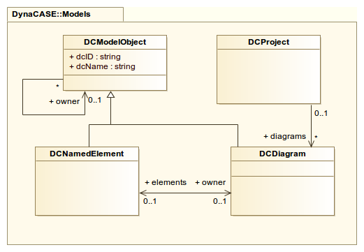

## Overall Architecture

###1\.  DC / Spec / Roassal composition

DynaCASE is attempting to follow in some respect MVC architecture\.

####1\.1\.  Model

The model itself is separated from the rest of the application and in fact can be used completely independently on any other part of the DynaCASE application\.

Element represents a singular object within the model \(e\.g\. UML class or UML generalization\)\. Diagram then encompasses all elements applicable to the given model\.

Project is abstraction on top of collection of diagrams\. This is mainly for application use, however it can still be used independently\. It is also aware of layout of each diagram\.

#####1\.1\.1\.  Events

Model is communicating with the outside world through it's API and events\.

Added/Removed event is fired when an element is added/removed into a diagram\. Change event is fired when either element or a digram has changed in any respect\. This could be change of some value \(e\.g\. name of an element\), or for diagram when the collection of elements is changed\. So for example when we add an element into diagram, both AddedEvent is fired from added element and ChangedEvent from the diagram\.

####1\.2\.  Controllers

Controllers provide binding between model, visualization and GUI\. Generally each model is controlled by it's own controller \(an appropriate descendant of DCController\)\. The responsibility of controller is to update model when some outside event requests it \(e\.g\. value is changed from a form\), and in turn update the visualization \(when model is changed\)\.

More complex and chaotic model of interactions between model, controllers, gui, roassal and trachel\.

####1\.3\.  View \(Roassal\)

DynaCASE uses Roassal2 from [Moose project](http://www.moosetechnology.org/)

Roassal \(and Trachel\) is well documented at [Agile Visualization](http://agilevisualization.com/#book)

Visualisation comes in multiple layers, application itself interacts mostly only with the top one

-  Roassal
-  Trachel \(part of Roassal\)
-  Athens \(part of Pharo\)
-  graphics library we should not care about

#####1\.3\.1\.  Roassal

Roassal2 is layer for manipulation with visual aspects in high\-level manners, for example manipulating with elements and connecting them with edges\.

Main behavior and drawing via Roassal is based on these Roassal parts:

&nbsp;

-  RTShapedObject \(RTElement or RTEdge\), which are semantic part, telling what we have and what is connected
-  RTShape \(RTEllipse, RTArrowedLine, etc\.\), which control what shapes and looks should elements and edges use
-  RTView, which is where objects above take place

Most of interaction from Roassal TO application is made using events\. Any object can tell \(subscribe\) RTAnnouncableObject \(RTShapedObject and RTView\) to make given action \(announce\) when given event occurs\. For example, when mouse clicks on such object \(Trachel event TRMouseClick occurs\)\.

#####1\.3\.2\.  Trachel

Trachel under it defines how exactly should shapes look \(TRShape\)\. All these shapes are drawn on surface called canvas \(TRCanvas\)\. For controlling what part of canvas is displayed Trachel uses TRCamera, defining zoom \(scale\), size and position of current crop of canvas\.

Trachel uses callbacks, which are somewhat similar to announcements/events, making specified action if predefined events with Trachel shapes occur \(when trachel object is resized, moved or removed\)\.
