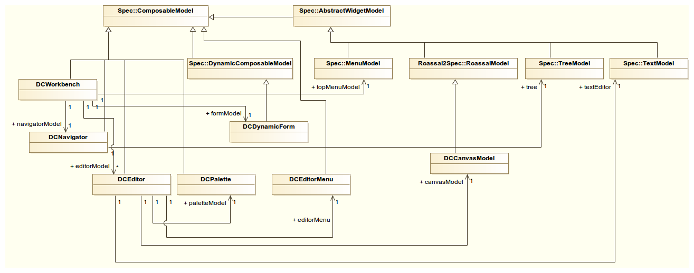

## GUI

-  DCWorkbench \- top level window of DynaCASE
-  topMenu \- menu bar providing basic project operations
-  DCNavigator \- sidebar displaying all models available in the opened project
-  DCEditor \- composition of other widgets representing an opened diagram\. DCEditors are organized as Spec Tabs
 \- [¿?](#Palette/Palette) \- palette of tools for interaction with the canvas
 \- DCCanvasModel \- Spec Model for Roassal's RTView

&nbsp;

-  [¿?](#DCDynamicForm) \- form for editing model values

