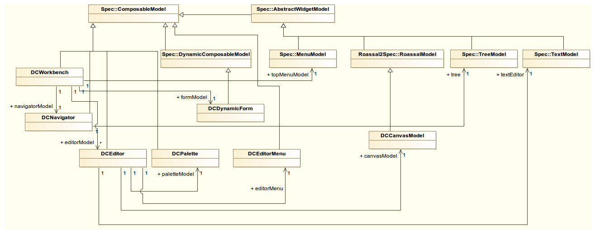

# GUI

OpenPonk window with highlighted important models

* DCWorkbench - top level window of OpenPonk
* topMenu - menu bar providing basic project operations
* DCNavigator - sidebar displaying all models available in the opened project
* DCEditor - composition of other widgets representing an opened diagram. DCEditors are organized as Spec Tabs
	* DCPalette - palette of tools for interaction with the canvas
	* DCCanvasModel - Spec Model for Roassal's RTView
* DCForm - form for editing model values

Composition between Spec models
