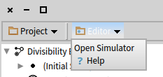
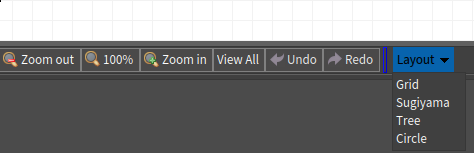

# Extending menus

You can extend both Workspace and Editor menus.

## Workbench menu

To add an item to the *Editor* item in the Workbench menu, create a method on the **class-side** of some class, preferably the class of your Plugin.

```st
DCFsmPlugin class>>toolbarFor: aBuilder
	<dcEditorToolbarMenu: #DCFsmPlugin>
	(aBuilder item: 'Help')
		icon: Smalltalk ui icons help;
		action: [ HelpBrowser openOn: DCFsmHelp ]
```

You can name the method however you want, but you must include the `<dcEditorToolbarMenu:>` pragma.

The pragma takes as the argument the name of the plugin you wish the menu to be associated with; this way you can register the menu item from any class:

```st
DCFsmSimulator class>>toolbarFor: aBuilder
	<dcEditorToolbarMenu: #DCFsmPlugin>
	(aBuilder item: 'Open Simulator')
		action: [ DCFsmSimulator new openOn: aBuilder model diagramController ]
```

The menu items will be automatically collected from all methods matching the pragma and the plugin name:



Too see all the available options you can specify for the menu item (submenu, icon, description, …) see the protocol of `PragmaMenuAndShortcutRegistrationItem`.

Finally `aBuilder model` keeps a reference to the appropriate `DCEditor` instance.

## Editor menu

The Editor menu is placed underneath the canvas, and works on the same principle.

You just need to name the pragma `<dcCanvasToolbar:>`.

```st
DCUmlClassPlugin>>canvasToolbarFor: aBuilder
	<dcCanvasToolbar: #DCUmlClassPlugin>
	(aBuilder item: 'Layout') action: [  ].
	aBuilder model diagramController addLayoutMenu: aBuilder parent: 'Layout'

DCUmlClassDiagramController>>addLayoutMenu: builder parent: aParent
	| classes inheritance associations centerY |
	...
	(builder item: 'Sugiyama')
		parent: aParent;
		action: [ RTSugiyamaLayout new
				doNotAttachPoint;
				verticalGap: 100;
				horizontalGap: 100;
				on: classes edges: inheritance.
			self view signalUpdate ].
```

Here `aBuilder model` holds a reference to the appropriate `DCCanvasModel` instance.


