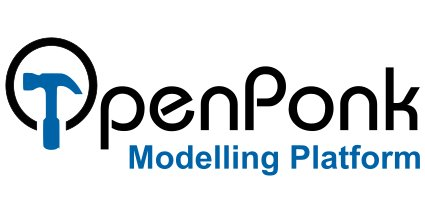

OpenPonk modeling platform
==========================

.. figure:: figures/license.svg

OpenPonk is a metamodeling platform and a modeling workbench implemented in the dynamic environment `Pharo <https://pharo.org>`_ aimed at supporting activities surrounding software and business engineering such as modeling, execution, simulation, source code generation, etc.

Workshop Paper
--------------

`IWST'16 <http://www.esug.org/wiki/pier/Conferences/2016/International-Workshop-IWST_16>`_ Workshop paper: `openponk_iwst16.pdf <http://esug.org/data/ESUG2016/IWST/Papers/IWST_2016_paper_25.pdf>`_

Showcase
--------

Showcase video for `ESUG 2016 conference <http://esug.org/wiki/pier/About>`_

.. raw:: html

   <iframe width="560" height="315" src="https://www.youtube.com/embed/_gQgXdJyr-0" frameborder="0" allowfullscreen></iframe>

Download
========

You can download preinstalled builds for each supported notation.

.. include:: download-matrix.txt

* All in One -- All notations in one image
* UML Class Diagrams with semi-complete UML 2.5 metamodel and XMI support
* `OntoUML <https://ccmi.fit.cvut.cz/methodologies/ontouml/>`_
* FSM - Finite State Machines
* Petri nets - PT Petri nets with arc weights and inhibitor and reset arcs
* BORM ORD — `Business Objects Relation Modeling <http://ccmi.fit.cvut.cz/methodologies/borm/>`_ Object-Relation Diagrams

Direct installation
===================

To install OpenPonk with all default plugins to an existing image, use the following snippet:

.. code-block:: smalltalk

   Metacello new
   	baseline: 'OpenPonk';
   	repository: 'github://openponk/openponk/repository';
   	load: 'complete'

Opening
=======

The downloaded package contains `README.md` with additional instructions, however on properly configured system launching `openponk.sh` (Linux) or `Pharo.exe` (Windows) should be sufficient.

Once launched, clicking on the desktop will show a menu containing entries for OpenPonk.

Requirements
============

Windows should work out of the box.

**Linux may require extra configuration** as Pharo VM is still primarily 32bit. Please refer to Pharo's [official guide](http://pharo.org/gnu-linux-installation).

Additionally you will require 32bit `cairo2` library, usually available in distribution package managers as `libcairo2:i386` (debian), `libcairo2`, etc.

The bundled launcher will check those requirements and will warn you and provide some tips if your system is not configured properly.

Contact
=======

**Centre For Conceptual Modeling and Implementation (CCMi):** https://ccmi.fit.cvut.cz

**Email:** openponk@gmail.com

**GitHub:** https://github.com/openponk

Sponsors
========

   
   OpenPonk is a registered Elixir CZ tool

Past Sponsors
=============

